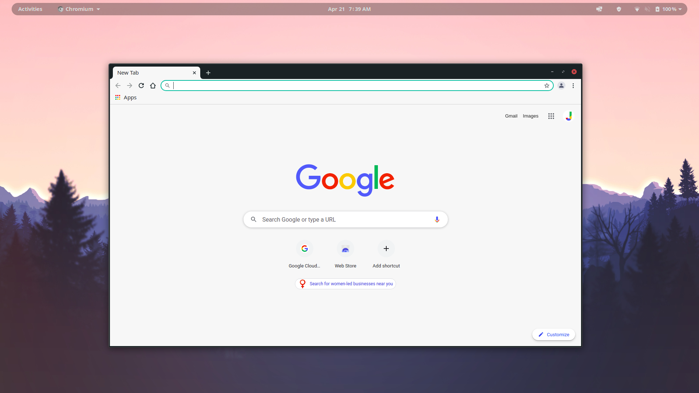
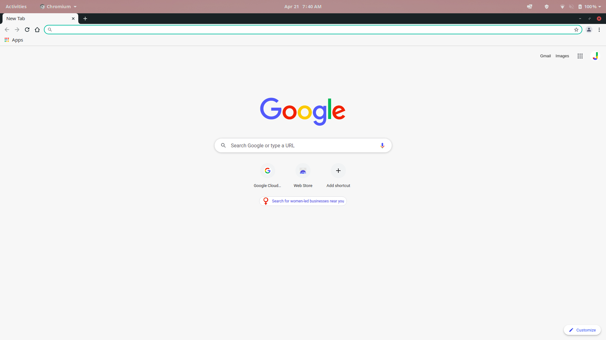

# Floating Top Bar

A GNOME Shell extension that makes the top bar transparent and makes it float when no windows are maximized. 

This is a fork based off of the Transparent Top Bar extension by zhanghai

**Floating**

**Maximized**

